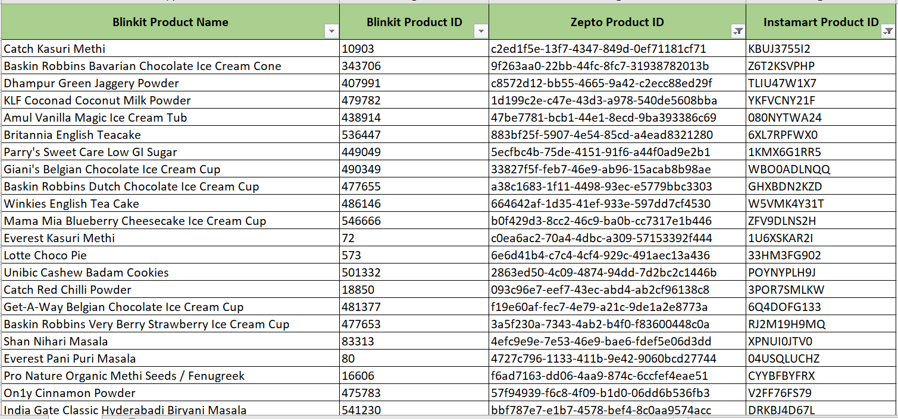
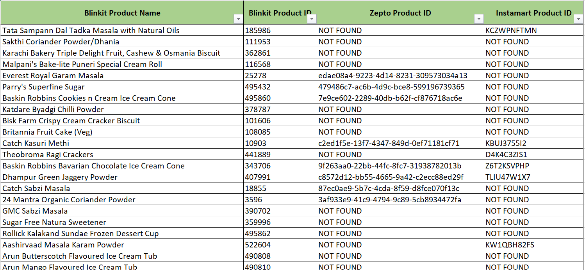

# Project: Cross Platform Product Mapping Algorithm for Products

## Objective:
Build an algorithm to map product IDs of the same product across Qcomm (Quick Commerce) platforms.

## Problem Statement:
The data file has product IDs for a few categories for all three Qcomm (Quick Commerce) platforms: **Blinkit**, **Zepto**, and **Instamart**. The objective of this project is to build an algorithm that maps exact products using product IDs across platforms by leveraging product information such as:
- **Title**
- **Brand Name**
- **MRP**
- **Volume**

### Example:
Baskin Robbins Bavarian Chocolate Ice Cream Cone has the following product IDs:  
- **Blinkit**: Product ID = `343706`  
- **Zepto**: Product ID = `9f263aa0-22bb-44fc-8fc7-31938782013b`  
- **Instamart**: Product ID = `Z6T2KSVPHP`

---

### Available Features in Data:
- *Title of Product*
- *Category Name*
- *Brand Name*
- *Volume Size*
- *MRP*

---

### Expected Outcome:
1. Develop an algorithm that calculates **similarity scores** for product IDs across platforms.
2. Map Blinkit product IDs to Zepto/Instamart product IDs if a match is found, otherwise map it as not found.

### Output Format:
- *Blinkit Product Name*
- *Blinkit Product ID*
- *Zepto Product ID (if match found)*
- *Instamart Product ID (if match found)*

### Approach:
The product ID mapping solution utilizes the following steps:
- **TF-IDF Vectorizer**: This is used to generate weighted text vectors for product titles, capturing the relevant keywords for similarity analysis.
- **Facebook AI Similarity Search (FAISS)**: Applied for coarse filtering, where cosine similarity is used to narrow down the most likely matches based on the text vectors.
- **Levenshtein Distance**: A refined matching step using this algorithm ensures that minor variations in product IDs are handled effectively, especially when platforms have different ID formats.

This approach achieved the following metrics when mapping Zepto or Instamart products to the Blinkit catalog:
- **Zepto**: **11.45% exact match rate**
- **Instamart**: **11.48% exact match rate**

These results enhance cross-platform consistency and accuracy.

---

### Repository Files:
1. **Data File**: [Assignment_Data.xlsx](./Data/Assignment_Data.xlsx)  
   Contains product and category details for all three platforms.
   
   
2. **Algorithm Code**: [Cross_Platform_Product_Mapping_Algorithm_for_Products.ipynb](./Cross_Platform_Product_Mapping_Algorithm_for_Products.ipynb)  
   Jupyter notebook with the defined algorithm for cross-platform product mapping.
   
 
3. **Output File**: [Output.csv](./Results/Output.csv)  
   Contains the Blinkit product ID and name along with the respective Zepto and Instamart IDs. If no match is found, "NOT FOUND" is indicated.
---

### Outcome:
#### Final Result:  

*(Case: exact match found across all platforms)*

*(Case: Matches may not be found across all platforms.)*

---

Feel free to contribute by improving the algorithm or suggesting optimizations!

### Disclaimer:
*The dataset utilized in this project has been obtained from public sources and is used solely for educational and research purposes. All efforts have been made to ensure that no proprietary or sensitive information is included. If you have any concerns or identify any conflicts regarding the use of this dataset, please feel free to get in touch. For inquiries or further information, you can <a href="mailto:cchaudha@usc.edu">contact me</a>.*

  
Thank you for taking the time to visit this repository!

